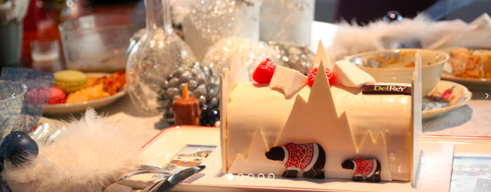

## A Happy New Year 2021!
<!--
**elizabethshen/elizabethshen** is a ✨ _special_ ✨ repository because its `README.md` (this file) appears on your GitHub profile.

Here are some ideas to get you started:

- 🔭 I’m currently working on ...
- 🌱 I’m currently learning ...
- 👯 I’m looking to collaborate on ...
- 🤔 I’m looking for help with ...
- 💬 Ask me about ...
- 📫 How to reach me: ...
- 😄 Pronouns: ...
- ⚡ Fun fact: ...
-->

 

Master of Computer Science. Received ***IBM Professional Data Science Certificate*** 

https://www.linkedin.com/pulse/brussels-best-neighborhoods-expats-elizabeth-shen/?trackingId=n54YI5mVRt6eB1wniArQ6A%3D%3D  

Experienced Website project manager/Internet business consulting 
Strong Communication Skills: Know how to talk to clients in a way that they understand, with or without IT backgrounds. 

Still new in Data Science/Machine Learning, but extremely curious to learn and explore more. 
I am especially interested in the **Data Modelling and Predication**.  
Please give me a chance to learn/work more in this area. I will be the outstanding one and make my contributions in the future.  
